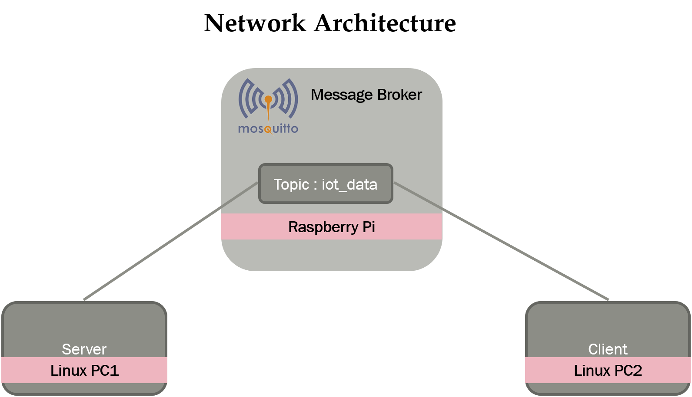

# IoT Data Analysis
Generating IoT data and analysing the data and predicting the next sample using linear regression.

## Server preparation
```
apt update && apt upgrade -y
apt install python3-pip  
pip3 install paho-mqtt
pip3 install psutil  
```

## Client preparation
```
apt update && apt upgrade -y
apt install python3-pip
pip3 install matplotlib
pip3 install drawnow
pip3 install paho-mqtt
```

### Network Architecture 
